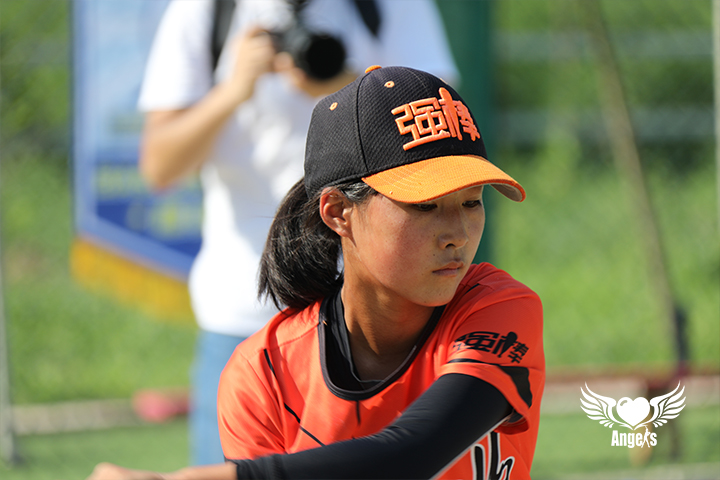
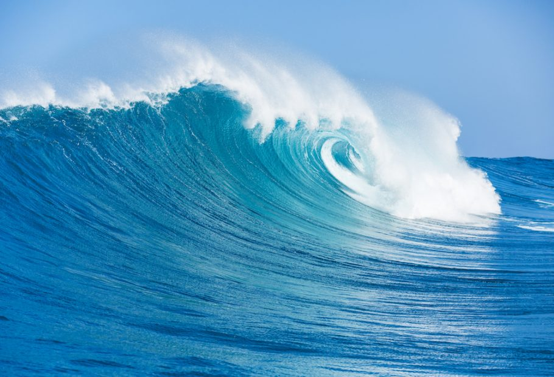

###### 对棒球不熟悉的同学们，赶紧来听听咱们棒球美少女曲比尔洛的介绍~~

**首先请欣赏曲比尔洛2个帅气训练的模样，请各位脑补任意喜欢的背景音乐🎵**

+++
帅气模样1

 

***

帅气模样2

 

> 欣赏完训练场上的帅照，好奇的棒球小白+吃瓜群众正式开始提问了。
> 
> Ready?
> 
> Go!!!!

Q1：什么时候开始学习棒球的？

A: 19年12月来到强棒，开始学习棒球。

Q2：每天的棒球训练时长是多久？

A: 周一到周五训练多一些，周六日休息多一些。冬天天短，一般是在下午2-5:30训练，夏天训练得久一点，会训练到7点。

Q3：在棒球基地的一天是如何度过的，每天做喜欢做的事情？

A: 早上6点多就起床了，洗漱收拾好、早餐后，会开始打扫自己负责的分区，上午开始学习，主要学语文和数学，但是学得一般，学语文的时候心里总想着数学，学数学的时候心里又想着语文🤔️……不过班里也没有谁学的特别好，大家都差不多。(场外小编：<u>此处真相了！</u>😅）

Q4：棒球学习过程中遇到过什么困难或问题？是如何克服这些问题的？

A: 训练分为体能训和棒球练习。比较喜欢练棒球，体能训很累很累，会做俯卧撑、平板等等。

Q5：棒球比赛中获得的荣誉，印象最深刻的瞬间？

A: 还没有打比赛的机会，因为疫情，很多比赛取消了。但是已经接种了疫苗，如果可以的话，今年想出去打打比赛，如果是海边就更好了，还没有见过海，很想去看看。

> 此处小编sis9带你立刻!马上!就看👀海!
> 
>  
