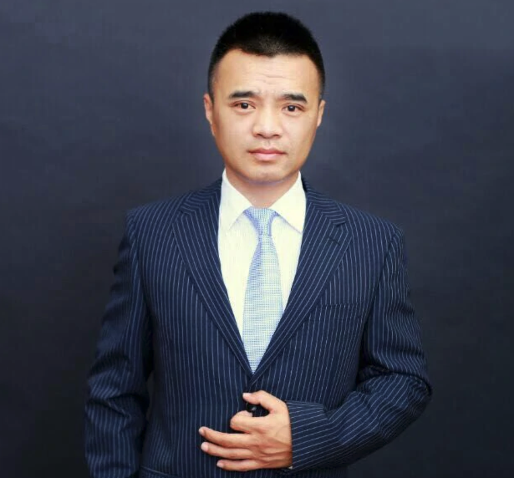
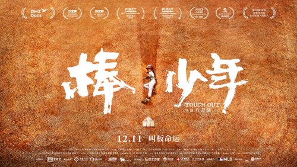
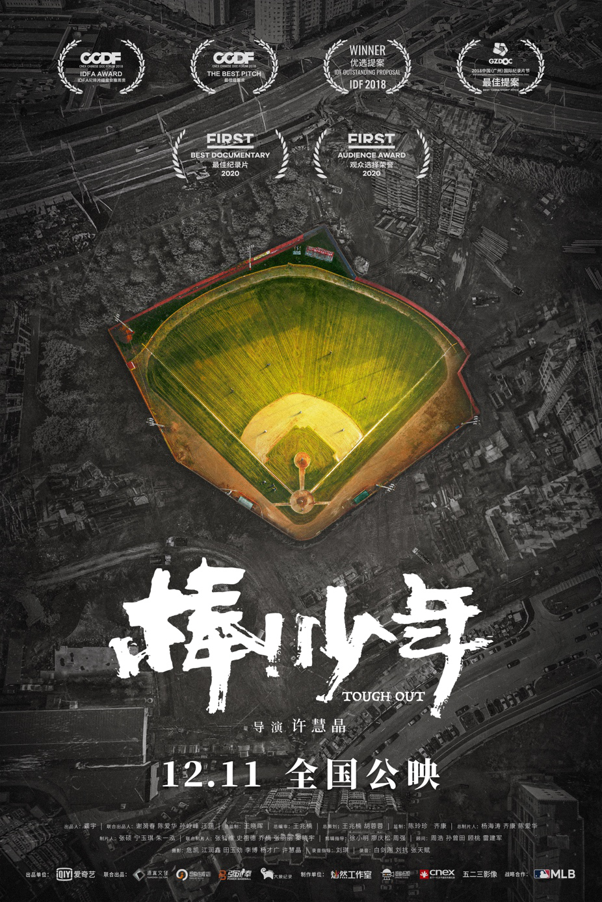
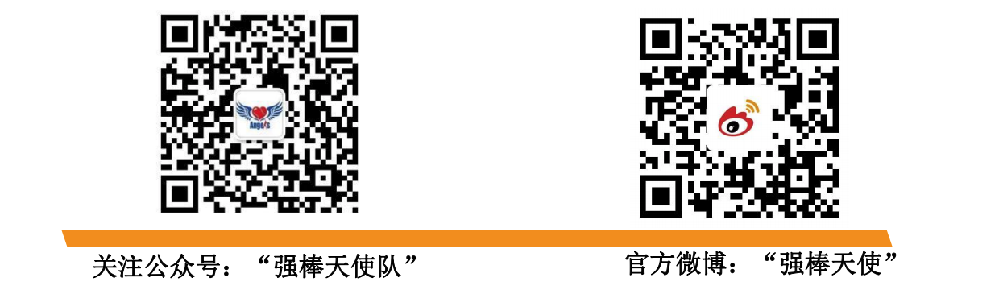

[强棒天使项目](https://baike.baidu.com/item/%E5%BC%BA%E6%A3%92%E5%A4%A9%E4%BD%BF%E9%A1%B9%E7%9B%AE/53242363)由前国家棒球队队长[孙岭峰](https://baike.baidu.com/item/%E5%AD%99%E5%B2%AD%E5%B3%B0)与爱心人士联合筹资建设，创建中国第一支公益棒球队。基地主要资助对象为全国范围内 7-10 岁困境儿童，通过专业的棒球技能获得职业发展方向和未来的就业机会。截止到 2020 年11月，项目共资助困境儿童80名，其中女孩 26名，多数儿童来自四川大凉山彝族自治州。通过基地的学习训练，她们重拾了信心也对未来建立目标，部分孩子通过努力训练走向了更大的舞台，获得了更多人的关注和认可。
 

**你不知道的“强棒天使队”，原来这么神奇？！**
+ “强棒天使队”，是中国第一支由困境儿童组成的公益棒球队。
+ 中国第一支由多民族儿童组成的棒球队。
+ 中国第一支代表亚太地区征战世界的少年棒球队。
+ 在国内外多项棒球赛事中披金斩银，成为了国内球队同年龄段当仁不让的第一，形成了难以置信的影响力。
+ 不仅中国的球队以能跟天使队打场比赛为荣，韩国、日本、美国的一些世界级的联赛争相邀请强棒天使队，作为<u>中国最高水平</u>的队伍参赛。
+ “强棒天使队”经常被邀请参加国内省市间的友谊邀请赛，同时作为北京唯一一支职业棒球队—北京猛虎队的后备力量培养。
+ 请欣赏一下之前拿过的奖项：
：豆瓣评分：8.7
> 
> 
> 2. 完整版在线观看: [《棒！少年》](https://www.iqiyi.com/v_21qpuwqny8o.html)
> 3. 欢迎关注“强棒天使队”
> 
